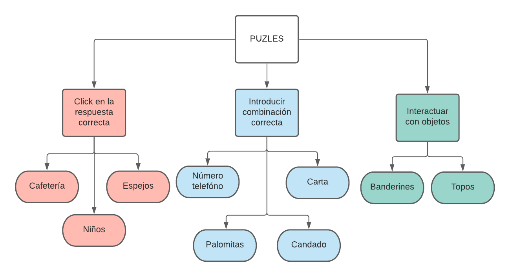
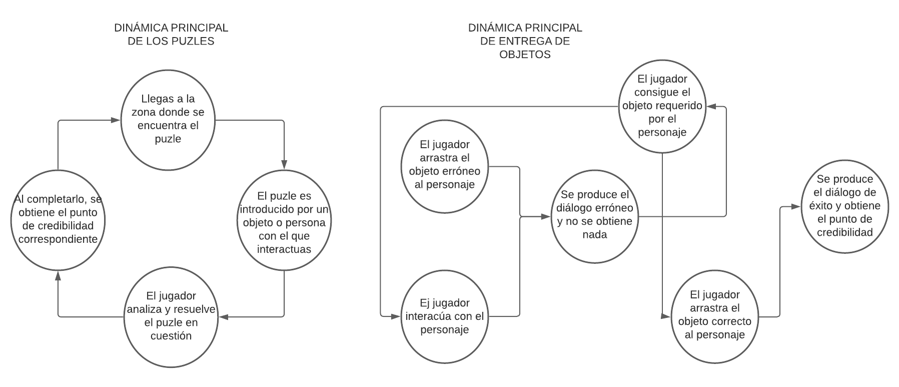
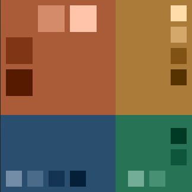
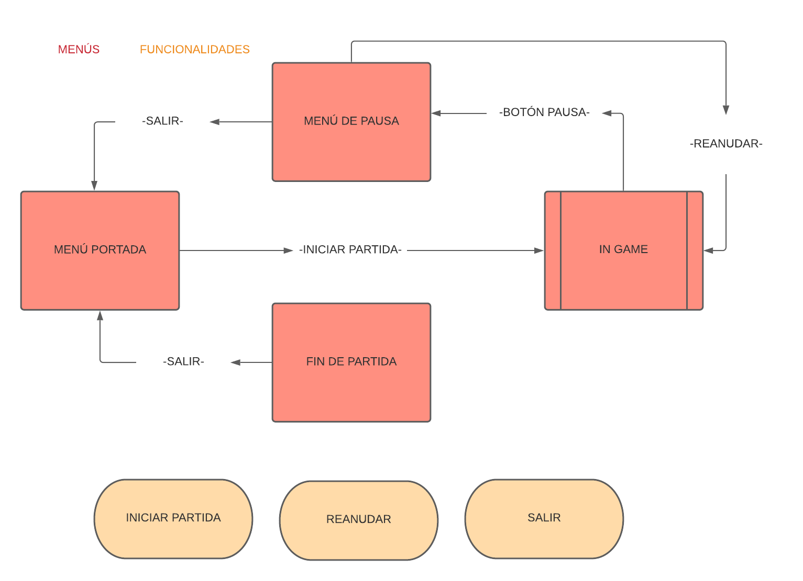

# The Right Man
**PVLI 2021-2022**

**Grupo 3:**
Elisa Todd Rodríguez,
Laura Gómez Bodego,
Antonio Povedano Ortiz,
Raúl Saavedra de la Riera.

**Género:** Puzles, aventura gráfica, misterio.

**Modos:** Historia, singlepayer.

**Público objetivo:**
    Edad: A partir de 15 años.
    Sexo: Cualquiera.
    Idioma: Español.
    
**Plataformas:** Navegadores web (PC).
Conexión a internet necesaria.

<h2>Descripción</h2>

En <em>The Right Man</em> tomaremos el papel de Donald Calthrop , un joven acusado a muerte por el crimen de su amada, que solo tú sabes que no has cometido. Para demostrar tu inocencia, tendrás que convencer al jurado, recogiendo pruebas e investigando lo que realmente ocurrió, antes de que se celebre el juicio. Mientras tanto intentarás limpiar tu nombre, ayudando a los habitantes del pueblo en sus tareas.

<h2>Logotipo y portada de juego</h2>

<h2>Aspectos generales</h2>

El juego será una mezcla entre aventura gráfica y puzles con toques de misterio.
Se pondrá un gran énfasis en la narrativa, que será el motor que desarrolle la historia, y llegando a ser uno de los puntos de más peso a nivel de jugabilidad.
La otra pieza clave de la jugabilidad son los puzzles, que se encontrarán distribuidos por las diferentes localizaciones del juego. Además de los puzles, podrá encontrar objetos que le ayudarán en su misión de demostrar su inocencia.

La historia gira en torno a un asesinato. El protagonista es acusado del mismo y deberá demostrar su inocencia. Para esto tendrá un tiempo limitado hasta que se celebre el juicio. Se dejará la intriga hasta el final, tanto al jugador como al protagonista, de si ha logrado reunir las pruebas suficientes para ser exculpado.

<h3>Vista general del juego</h3>

<h3>Relato breve y parcial de una partida típica</h3>

Anotación: Entenderemos por habitación cada pantalla o escenario que forma parte del juego y por el que el jugador puede desplazarse. Cada habitación es diferente y se unen formando una conexión de habitaciones por las que el jugador se mueve para avanzar en el juego.

La partida comenzará en la habitación correspondiente a la plaza del pueblo. A partir de ese momento podrá desplazarse por las diferentes habitaciones en las que podrá recoger objetos y realizar pequeños puzles en su intento de avanzar en la historia y ganarse una buena reputación. Para ello deberá recoger objetos en las habitaciones por las que se le vaya permitiendo avanzar e intentar utilizarlos con las personas adecuadas. Además encontrará problemas en forma de puzles que intentará resolver, que también contribuirán a obtener su inocencia. El objetivo es encontrar y resolver la mayor cantidad de problemas posible, antes de que se acabe el tiempo.

    
 
Tras pasar 15 minutos, terminará el control del jugador sobre la partida y comenzará el juicio. Si ha conseguido realizar 7 puzles de los 15 posibles, será declarado inocente. Si no ha llegado a ese mínimo, será condenado a muerte. Además, si ha resuelto todos los puzles durante el trascurso de la partida, al final del juicio se sabrá lo que realmente le ocurrió a su amada, y el verdadero culpable del crimen.

<h2>Jugabilidad</h2>
<h3>Mecánica</h3>

<h4> Mecánicas del personaje</h4>
<ul>
<li>Interacción con objetos: El jugador podrá interactuar con objetos arrastrándolos hacia un punto o recogerlos para guardarlos en su inventario, clicando en ellos. Si los intenta arrastrar habrá dos posibles resultados. El primer caso es que volverán a su inventario sin que ocurra nada una vez suelte el objeto. Si no, activarán un evento que desbloqueará un porblema o un diálogo con un NPC.</li>
<li>Interacción con personajes (NPCs): El jugador podrá interactuar con los personajes que se vaya encontrando por las diferentes habitaciones. Lo hará clicando sobre ellos, y, si tienen algún diálogo disponible, se activará. También se les podrá intentar entregar objetos, lo que desencadenará la mecánica descrita anteriormente.</li>
</ul>

<h4>Mecánicas de escenario</h4>
<ul>
<li>Cambio de habitación: En el lateral izquierdo y derecho de la pantalla, y en la parte superior e inferior, se sitúan unos elementos interactuables en forma de flecha, señalando hacia la siguiente habitación. Al interactuar con dichos elementos, la cámara se moverá hacia la habitación situada a continuación de la actual, en la dirección indicada por la flecha. No todas las habitaciones tendrán las cuatro flechas, sólo flechas apuntando hacia la dirección en la cual sea posible desplazarse.
<li>Paso del tiempo controlado: Con el inicio del juego comienza una cuenta atrás que delimita el tiempo de partida. El tiempo restante se muestra al jugador.</li>
<li>Pop ups: Al interactuar con los personajes del juego, o al activar un puzle, se mostrará una nueva pantalla, a la que llamaremos pop-up. Podrá ser una pantalla de diálogo o una pantalla que muestra un puzle. Los pop ups serán diferentes con cada uno de estos casos. En el caso del diálogo, se mostrará al protagonista y al NPC con el que se hable, y un cuadro de texto en la zona inferior. En el caso de los puzles, ocupará toda la pantalla, impidiendo ver la habitación actual.</li>
</ul>

<h4>Mecánicas de puzles</h4>
<ul>
<li>Escribir un número o palabra: para este tipo de puzles tendremos que escribir por teclado la solución del problema, ya sea un número o alguna palabra clave. Los puzles que se resolverán con esta mecánica son Números Rasgados y La Carta, Encadenados, El Código Indiscreto</li>
<li>Clicar en la solución correcta: para este tipo de puzles tendremos que clicar con el puntero del ratón en la solución del puzle que creamos correcta. Las opciones se mostrarán en la pantalla. Los puzles que se resolverán con esta mecánica son Alarma por el Expreso, Inocencia y Juventud y El Juego de los Espejos.</li>
<li>Arrastrar con el puntero: para este tipo de puzles tendremos que arrastrar los diferentes elementos que se nos indique en cada uno de los puzles para poder superarlos. Los puzles que se resolverán con esta mecánica son Banderines de Vértigo y Topoz.</li>
    
</ul>

<h4>Controles</h4>

El jugador podrá moverse apuntando y hclicando con el puntero del ratón en la flecha correspondiente a la dirección en la que desea desplazarse. Para interactuar con objetos y personajes también utilizará el ratón, clicando sobre aquello con lo que quiera interactuar.

<h4>Cámara</h4>

El jugador tendrá una vista en 2D de la habitación en la que se encuentre. Se mostrarán todos los objetos y detalles de la habitación que sean necesarios para el trascurso de la partida. Es un juego en primera persona, y el propio jugador no podrá verse a sí mismo.

En el lateral derecho, separado del escenario, habrá una vista del inventario del jugador.

<h3>Dinámica</h3>

Hay un sistema de puntuación interno: la reputación. Se mide en números enteros y comenzará a 0. Cada vez que el jugador resuelva un problema en el pueblo, su reputación aumentará en un punto, hasta un máximo de 15. El objetivo del juego es ser declarado inocente, por lo que el jugador debe intentar resolver la mayor cantidad de puzles posible para tener una buena reputación.
El juego tiene tres posibles finales, dependiendo de la reputación que el jugador pueda conseguir en el tiempo dado.
    <ul>
<li>Perder: Si al finalizar el tiempo la reputación tiene un valor de 7 o menor, el jugador pierde.</li>
<li>Ganar: Si al finalizar el tiempo la reputación tiene un valor de 8 o mayor, el jugador gana.</li>
<li>Ganar con final perfecto: Si al finalizar el tiempo la reputación tiene un valor exacto de 15, el jugador gana, y, además, se mostrará el verdadero culpable del crimen.</li>
</ul>

Durante una misma sesión de juego, se mostrará al jugador su récord de reputación conseguida en una partida, en un desplegable del menú de inicio.
Del jugador se espera que desarrolle una estrategia basada en observar bien las habitaciones y relacionar los elementos que contienen. Para resolver los puzles se requiere tener habilidades lógicas e intuitivas.

Es de esperar que el jugador promedio necesite jugar más de una vez para conseguir ganar con el final perfecto. Esto se conseguirá ajustando el tiempo límite para que el jugador tenga que administrar bien el tiempo, y ser rápido en la observación de los escenarios. Con cada vez que juegue se dará cuenta de algunos aspectos del juego de los que no se había percatado en su partida anterior, avanzando así y pudiendo superar el juego completo en dos o tres partidas de media.

En el juego hay diferentes puzles cada uno con una dinámica única que deberemos completar para poder avanzar en el juego. Estos puzles son:

<ul>
<li>Alarma por el Expreso: en este puzle se presentarán cuatro mesas con un número determinado de objetos de diferente valor. En una de las mesas faltará un objeto y el jugador deberá averiguar cual es el objeto que se necesita en esa mesa para que todas ellas tengan el mismo valor.</li>
<li>Números rasgados: para completar este puzle el jugador deberá obtener la combinación correcta de una secuencia de números. Para ello se darán una serie de pistas para poder saber el orden de ellos.</li> 
<li>Banderines de Vértigo: para completar este puzle se deberá encontrar el orden correcto de una serie de banderines, para que los signos matemáticos y números que cada uno representa, formen una operación que tenga sentido matemático.</li>
<li>El Código Indiscreto: en este puzle se presentará al jugador una imágen con un código numérico oculto. Deberá descifrarlo para completar el puzle.</li>
<li>El Juego de los Espejos: en este puzle se presentará una pantalla con vista cenital mostrándonos una serie de espejos colocados de diferentes formas junto con un pequeño láser. El objetivo será obtener el camino que haría el láser al rebotar con ellos averiguando por cuales de las diferentes salidas pasará el láser al final.</li>
<li>Topoz: en este puzle se presentará un tablero 3x3 donde estarán todas las piezas cara abajo. Al clicar sobre una de ella, esa pieza y todas las adyacentes cambiarán a la posición opuesta a la que se encontraban. Para completar este puzle el jugador deberá colocar todas las piezas del tablero cara arriba.</li>
<li>La Carta: en este puzle se presentará un texto del cual el jugador deberá sacar un mensaje secreto, a partir de la primera letra de cada frase.</li>
<li>Inocencia y juventud: en este puzle se presentarán cuatro personajes que están acusados de un hurto. Cada uno de ellos da una frase en su defensa, aunque solo uno de ellos dice la verdad. Para completar este puzle el jugador deberá averiguar, utilizando la lógica, cuál de los personajes es el verdadero culpable.</li>
<li>Encadenados: en este puzle se presenta un sistema de ecuaciones codificadas con una serie de símbolos. Cada símbolo representará un número de una cifra. De esta manera deberemos obtener el valor de cada símbolo para sacar la combinación correcta, que está compuesta de dos símbolos, indicados en el candado.</li>
    </ul>

La última dinámica es la recolección de objetos, esparcidos por el mapa de juego, que se utilizarán para intentar ayudar a los diferentes personajes que se encuentren. El jugador deberá hacer uso de la lógica para intuir que objeto puede servir de ayuda a cada NPC con el que hable, apoyándose en los diálogos que haya tenido con dicho personaje. Cada vez que haga un uso adecuado de un objeto, su reputación aumentará en un punto.

<ul>
<li>Moneda: se entregará al niño de la feria.</li>
<li>Carta: se entregará a la dueña de la sombrerería. Una vez entregada desbloqueará el camibo hacia el bosque.</li>
<li>Sombrero: se entregará a la clienta de la sombrerería.</li>
<li>Flor: se entregará al enamorado del parque.</li>
<li>Pescado: se entregará a la señora de la calle comercial.</li>
<li>Pajarita: se entregará al policia en el bosque.</li>
<li>Caja de cartón: se entregará al campesino en el bosque.</li>
</ul>

<h3>Estética</h3>
    

La paleta de colores del juego se basará en tonos pastel apagados recordando a las películas de Hitchcock. Dará el ambiente lúgubre y pesimista que se vive en el pueblo tras el asesinato, a la vez que refleja la situación animica del protagonista.

El estilo artístico del juego será minimalista para reforzar a nivel visual los objetos relevantes para los puzzles.

Los diferentes escenarios constarán de fondos simples que establecerán la ambientación de un antiguo pueblo inglés. Los objetos que se encuentren por las habitaciones, y no tengan relevancia con la trama, mantendrán la simpleza, acentuando sólo los elementos necesarios para el uso correcto e intuitivo por parte del jugador; evitando así la sobrecarga visual en el escenario.

En la misma línea los personajes que se presenten ante el jugador serán sencillos, dando predilección por elementos característicos (bigotes, sombreros, barbas, vestimenta…) sobre el detalle elevado; manteniendo la concordancia y dando estímulos visuales al jugador.

<h2>Menús y modos de juego</h2>

El juego poseerá 3 menús:

<ul>
<li>Menú portada: el menú que se encontrará el jugador al entrar al juego y siempre que salga de partida. Tendrá el botón de inicio de partida y servirá como puente para entrar al juego como tal. También mostrará el mayor porcentaje de credibilidad que el jugador haya conseguido en la sesión de juego.</li>

<li>Menú de pausa: menú que podrá desplegar el jugador en cualquier momento que este ingame: podrá reanudar la partida y salir. Mientras esté activado, no transcurrirá el tiempo límite de la partida.</li> 

<li>Menú fin de partida: menú donde se mostrará el porcentaje de reputación que se ha conseguido al finalizar la partida. Tendrá una imagen diferente según si el jugador ha sido declarado inocente o culpable. Desde él se puede salir al menú portada.</li>    
</ul>

<h3>Configuración</h3>

**Sonido:** se puede tanto activar como desactivar el sonido en el juego.

<h3>Interfaz y control</h3>

La interfaz de juego tendrá un botón de pausa que parará el cronómetro juego y dará acceso a un menú con tres botones de interacción:

<ul>
    <li>Botón de sonido: botón que permite activar o desactivar el sonido en cualquier momento.</li>
    <li>Botón de reanudar partida: vuelve al curso del juego y la cuenta atrás se reactiva.</li>
    <li>Botón de salir: da acceso a la portada del juego en la que se da la opción de reiniciar la partida.</li>
</ul>   
    
Otros elementos de interfaz que formarán parte del juego son:

<ul>
    <li>Botón de iniciar partida: se encuentra en la pantalla de inicio y, al pulsar en este se inicia una partida nueva.</li>
    <li>Flechas de cambio de pantalla: permiten al jugador cambiar habitación, moviéndose así por todo el escenario.</li>
    <li>Cronómetro: Muestra el tiempo de juego restante.</li>
</ul>

<h2>Contenido</h2>

El juego consta de 10 habitaciones en las habrá difrerentes puzles y enigmas a descifrar.

<h3>Historia</h3>

Se ha encontrado el cadáver de Grace Bergman, hija del Alcalde de la ciudad, en trágicas condiciones. Donald Calthrop es el principal acusado, ya que mantenían una relación sentimental y fue el último en verla con vida, durante la feria del pueblo. El alcalde acusa a Donald sin cuestionarlo, ya que creía que trataba mal a la víctima. Llega una carta a casa de Donald, es el principal sospechoso. Tiene un día para demostrar su inocencia y encontrar simpatizantes entre el jurado popular. 

Donald debe demostrar que no es el asesino, e intentar descubrir que el verdadero culpable ha sido el acosador de Grace, Alfred; cuya  existencia era desconocida.

Donald irá recogiendo pruebas para demostrar que la última vez que vio a la víctima, ella estaba viva, y fue Alfred, loco de amor por Grace, quien la asesinó tras no poder asimilar su rechazo.

<h3>Personajes</h3>
<ul>
    <li>Donald: protagonista del juego, se ve todo desde su punto de vista. Ha sido acusado de un asesinato y debe ir entregando objetos y resolviendo puzles para ganarse la simpatía del pueblo y demostrar su inocencia.</li>
    <li>Policía: Al principio del juego impide el paso de la plaza al camino hacia la feria. Con el avance del juego, el policía se desplaza habilitando el paso.</li>
    <li>Gerente: Se encuentra en la plaza, es el dueño de la cafetería.</li>
    <li>Primo: Se encuentra al entrar en la casa de Donald. Está indeciso sobre si apoyar a su primo o no, asustado por el qué dirán.</li>
    <li>Señora: Se encuentra en la calle comercial. Está preocupada porque su gato está atrapado en un árbol.</li>
    <li>Carnicero: Se encuentra en la zona del mercado, encargándose de su puesto.</li>
    <li>Enamorado: Se encuentra en el parque, está desesperado porque no sabe qué regalarle a su amada.</li>
    <li>Dueña: Se encuentra en la sombrerería. Era la antigua jefa de Grace, y llora su pérdida.</li>
    <li>Clienta: Está en la sombrerería. Se muestra preocupada por no poder encontrar un sombrero que le agrade.</li>
    <li>Campesino: Se encuentra en la zona del bosque. Está muy atareado ya que su cargamento se ha desperdigado al romperse su carro de transporte.</li>
    <li>Circense: Está en la zona de la feria, es el jefe del recinto ferial. Necesita ayuda con los últimos preparativos antes de la noche de feria.</li>
    <li>Niño: Se encuentra en la zona de la caseta de feria. Está llorando porque no tiene dinero para montarse en un tiovivo.</li>
    <li>Forzudo: Se encuentra en la caseta de feria.</li>
    <li>Excéntrico: Se encuentra en la casa de los espejos.</li>
</ul>

<h3>Objetos</h3>
<ul>
<li>Moneda: se encontrará en la plaza del pueblo, en el suelo junto a la fuente.</li>
<li>Sombrero: se encuentra en la casa de Donald, colgado de un perchero.</li>
<li>Carta: se encuentra en la casa de Donald, en el suelo junto a la puerta.</li>
<li>Pajarita: se encuentra en el camino hacia la feria, entre la maleza del bosque.</li>
<li>Flor: se encuentra en la calle comercial, en un rosal.</li>
<li>Pescado: se encuentra en el mercado, en el suelo junto al puesto de pescadería.</li>
<li>Caja de cartón: se encuentra en el parque, tirada en el suelo.</li>
</ul>

<h3>Niveles</h3>

El juego no se divide en niveles sino que se desarrolla toda la trama e historia del juego en una única partida con una duración determinada. 

<h3>Cinemáticas</h3>

Habrá cuatro cinemáticas principales. Al inicio se mostrará cómo se descubre el cadáver, al alcalde colerizado y la llegada y lectura de la carta a casa de Donald.
Al final del juego se presentarán tres cinemáticas diferentes, dependiendo de los resultados obtenidos por el jugador:

<ul>
<li>Si ha perdido por no tener suficiente reputación, se mostrará el juicio en el que se le declara culpable y se le condena a muerte.</li>
<li>Si ha conseguido una reputación intermedia, se mostrará el juicio en el que se declara a Donald inocente.</li>
<li>Si, en cambio, se ha conseguido la máxima reputación, se mostrará el juicio con la acusación de Alfred, las disculpas del alcalde por la falsa acusación de Donald, y Alfred será condenado a muerte.</li>
</ul>

<h2>Referencias</h2>
<ul>
<li><h4>Rusty lake Saga.</h4>
    
Compañía: Rusty Lake

    
Año de lanzamiento del primer juego: 2015

    
Referencias que se han tomado: escenario y mecánica.

    
</li>
    
<li><h4>Spotlight room escape</h4>
    
Compañía: Javelin OU

    
Año de lanzamiento: 2015

Referencias que se han tomado: escenario y mecánica.

</li>

<li><h4>El profesor Layton (Saga)</h4>
    
Compañía: Nintendo

    
Año de lanzamiento: 2007

    
Referencias que se han tomado: puzles y estética.

</li>
    
<li><h4>Películas de Alfred Hitchcock</h4>
    
El juego está basado en el tópico utilizado por el cineasta frecuentemente en sus películas, en las que alguien era acusado de un crimen que nunca cometió. Puede observarse en las siguientes películas: <em>Vértigo</em> (1958), <em>Falso culpable</em> (1956), <em>Con la muerte en los talones</em> (1959). Además, los nombres de los puzles están inspirados en los títulos de la filmografía de este director.

</li>
    
    
